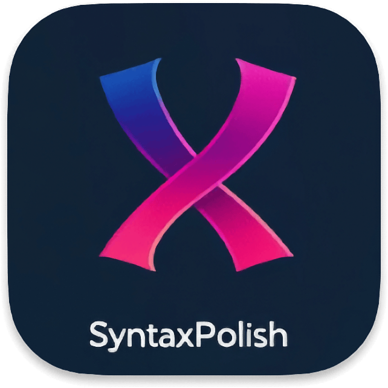

[](LICENSE)
[](https://github.com/mickaellherminez/syntax-polish/releases/latest)
[](https://github.com/mickaellherminez/syntax-polish/releases)

<p align="center">
  
</p>

# ✨ Syntax Polish — Alfred Workflow (Multi-AI)

Syntax Polish est un **workflow Alfred pour macOS** qui permet de corriger, reformuler
ou améliorer du texte instantanément grâce à des **IA modernes**
(DeepSeek, OpenAI, Anthropic, etc.).

🔒 **Sécurisé par design**  
🧠 **Multi-IA dès le départ**  
⚡ **Rapide et simple à utiliser**

---

## 🚀 Fonctionnalités

- Correction grammaticale et stylistique
- Reformulation professionnelle / naturelle
- Amélioration de texte sélectionné
- Support multi-IA interchangeable
- Résultat copié automatiquement dans le presse-papier

### 🧠 Comment fonctionne la correction

- Le texte sélectionné est envoyé (par défaut) à DeepSeek avec un **prompt spécialisé** de correction.
- L’IA corrige l’orthographe, la grammaire, la ponctuation et le style **sans changer le sens ni le ton**.
- La langue est détectée automatiquement et la réponse est produite dans la **même langue** que le texte d’origine.
- La sortie contient **uniquement le texte corrigé**, sans explications ni commentaires.

---

## 📦 Installation

1. Télécharger le fichier `.alfredworkflow` depuis la page **Releases**
2. Double-cliquer pour l’importer dans Alfred
3. Configurer votre clé API (voir ci-dessous)

---

## 🔐 Configuration des clés API (OBLIGATOIRE)

⚠️ **Aucune clé n’est fournie**  
Chaque utilisateur doit configurer **sa propre clé API**.

### Méthode la plus simple (recommandée) : configuration guidée dans Alfred

1. Ouvre Alfred
2. Tape : `sp setup`
3. Choisis le fournisseur (DeepSeek / OpenAI / Anthropic)
4. Colle ta clé API (saisie masquée)

✅ La clé est enregistrée **dans le Trousseau macOS (Keychain)**  
✅ Aucune clé n’est stockée dans Alfred, le workflow ou le repo

### Méthode recommandée : Keychain macOS

Exemple pour DeepSeek :

```bash
security add-generic-password \
  -a "$USER" \
  -s "syntax-polish-deepseek" \
  -w "VOTRE_CLE_API"
```

Autres providers :

* `syntax-polish-openai`
* `syntax-polish-anthropic`

✅ Les clés sont chiffrées par macOS  
✅ Rien n’est stocké dans le workflow ou le repo

### Vérifier / supprimer une clé API existante

Pour **vérifier** qu’une clé est bien présente dans le Trousseau, sans afficher la valeur de la clé :

```bash
if security find-generic-password -a "$USER" -s "syntax-polish-deepseek" >/dev/null 2>&1; then
  echo "Clé DeepSeek trouvée dans le Trousseau (service: syntax-polish-deepseek)."
else
  echo "Aucune clé DeepSeek trouvée pour ce service."
fi
```

Pour **supprimer** une clé du Trousseau :

```bash
security delete-generic-password -a "$USER" -s "syntax-polish-deepseek"
```

Adapte le service en fonction du provider :

- `syntax-polish-deepseek`
- `syntax-polish-openai`
- `syntax-polish-anthropic`

---

## ⚙️ Variables Alfred

### `AI_PROVIDER` : choisir le provider IA par défaut

Par défaut, Syntax Polish utilise **DeepSeek**.  
Tu peux changer de provider en définissant la variable **`AI_PROVIDER`** dans Alfred.

#### Étapes

1. Ouvre **Alfred → Preferences… → Workflows**.  
2. Sélectionne le workflow **Syntax Polish**.  
3. Clique sur le bouton **`[x] Configure Workflow…`** en haut à droite.  
4. Va dans l’onglet **Environment Variables**.  
5. Clique sur le bouton **`+`** en bas de la liste.  
6. Renseigne :
   - **Name** : `AI_PROVIDER`  
   - **Value** : l’une des valeurs suivantes :

| Provider   | Valeur `AI_PROVIDER` |
|-----------|-----------------------|
| DeepSeek  | `deepseek`           |
| OpenAI    | `openai`             |
| Anthropic | `anthropic`          |

7. Clique sur **Save**.  

À partir de là, toutes les corrections utiliseront ce provider par défaut (si l’implémentation existe côté code).

> 💡 Remarque  
> Tu peux enregistrer **plusieurs clés API** dans le Trousseau macOS en même temps  
> (`syntax-polish-deepseek`, `syntax-polish-openai`, `syntax-polish-anthropic`).  
> C’est uniquement la variable **`AI_PROVIDER`** qui détermine **quel provider est utilisé** :
> - si `AI_PROVIDER` n’est pas définie, Syntax Polish utilise **`deepseek`** par défaut ;
> - si tu mets `openai` ou `anthropic`, ce sera pris en compte automatiquement une fois la clé API enregistrée.

### Autres variables

| Variable | Description    | Exemple |
|----------|----------------|---------|
| `DEBUG`  | Logs détaillés | `0` ou `1` |

---

## ⌨️ Utilisation

1. Sélectionner du texte
2. Lancer le raccourci Alfred
3. Le texte corrigé est copié automatiquement

### Raccourci clavier Alfred

Par défaut, **aucun raccourci clavier n’est défini par Alfred à l’installation**.

Après avoir importé le workflow, choisis ton propre raccourci (par exemple `⌘&`) :

1. Ouvre **Alfred → Preferences… → Workflows**.
2. Sélectionne le workflow **Syntax Polish**.
3. Clique sur le bloc **Hotkey** du workflow.
4. Appuie sur la combinaison voulue pour l’enregistrer (ex. `⌘&`).

👉 Tu peux changer ce raccourci à tout moment si un autre workflow utilise déjà la même combinaison.

---

## 🧠 IA supportées

* DeepSeek
* OpenAI
* Anthropic
  (architecture extensible)

---

## 🔒 Sécurité & confidentialité

* Aucun tracking
* Aucun log sensible
* Aucun stockage de texte
* Le texte est envoyé uniquement à l’IA choisie

👉 Voir [`docs/privacy.md`](docs/privacy.md)

---

## 🧑‍💻 Développement

* Python 3
* Code formaté avec **Black**
* Linting avec **Ruff**
* Règles strictes via **Cursor Rules**

👉 Voir [`instructions.md`](instructions.md)

---

## 🏷️ Versioning & Releases

Le projet suit **SemVer** : `MAJOR.MINOR.PATCH`.

- **Source de vérité** : `VERSION` (et synchronisé dans `workflow/info.plist`)
- **Build artefact** : `bash scripts/build_workflow.sh` (génère `dist/Syntax-Polish-vX.Y.Z.alfredworkflow`)
- **Release** : `bash scripts/release.sh --bump patch` (ou `--set X.Y.Z`)

➡️ Publie ensuite l’artefact `.alfredworkflow` et `dist/SHA256SUMS.txt` dans GitHub Releases.

### Procédure complète pour créer une Release GitHub

> Note : le repo versionne la **source** (`workflow/`, `src/`, docs). Les fichiers de sortie dans `dist/` sont des **artefacts générés** (non commit) et sont à uploader dans une GitHub Release.

1. **Mettre à jour la version**

- Bump automatique (recommandé) :

```bash
bash scripts/release.sh --bump patch
```

- Ou fixer explicitement :

```bash
bash scripts/release.sh --set X.Y.Z
```

Ce script :
- met à jour `VERSION`
- met à jour `workflow/info.plist` (clé `version`)
- ajoute une section **TODO** dans `CHANGELOG.md` (à compléter)
- génère l’artefact `.alfredworkflow` versionné dans `dist/`
- génère `dist/SHA256SUMS.txt`

2. **Compléter le changelog**

Édite `CHANGELOG.md` et remplace le `TODO` par les changements réels de la release.

3. **Commit & tag**

```bash
git add VERSION workflow/info.plist CHANGELOG.md
git commit -m "chore: release vX.Y.Z"
git tag "vX.Y.Z"
git push
git push --tags
```

4. **Vérifier les artefacts générés**

Après `scripts/release.sh`, tu dois avoir :
- `dist/Syntax-Polish-vX.Y.Z.alfredworkflow`
- `dist/SHA256SUMS.txt`

5. **Créer la GitHub Release**

- Crée une release GitHub pour le tag `vX.Y.Z`
- Uploade en assets :
  - `dist/Syntax-Polish-vX.Y.Z.alfredworkflow`
  - `dist/SHA256SUMS.txt`

6. **(Optionnel) Nettoyer `dist/`**

Tu peux supprimer `dist/` après upload : il sera régénéré au prochain build.

---

## 📄 Licence

MIT


